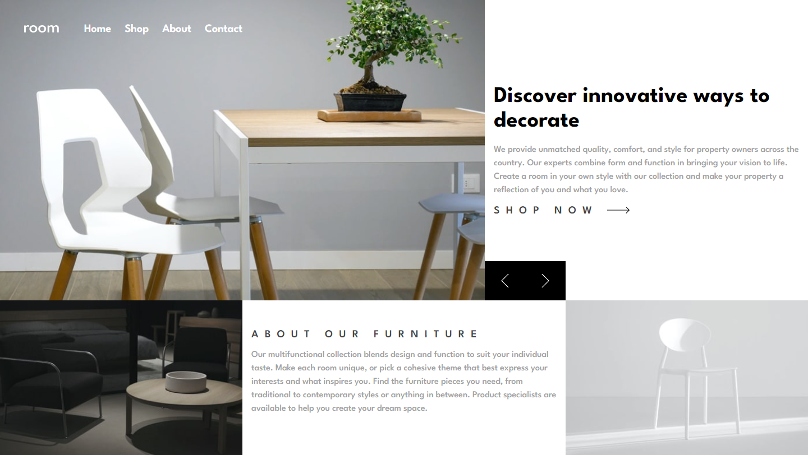

# Frontend Mentor - Room homepage solution

This is a solution to the [Room homepage challenge on Frontend Mentor](https://www.frontendmentor.io/challenges/room-homepage-BtdBY_ENq). Frontend Mentor challenges help you improve your coding skills by building realistic projects.

## Table of contents

- [Overview](#overview)
  - [The challenge](#the-challenge)
  - [Screenshot](#screenshot)
  - [Links](#links)
- [My process](#my-process)
  - [Built with](#built-with)
- [Author](#author)

**Note: Delete this note and update the table of contents based on what sections you keep.**

## Overview

### The challenge

Users should be able to:

- View the optimal layout for the site depending on their device's screen size
- See hover states for all interactive elements on the page
- Navigate the slider using either their mouse/trackpad or keyboard

### Screenshot




### Links

- Solution URL: [solutions/Room-homepage](https://your-solution-url.com)
- Live Site URL: [Room-homepage live preview](https://your-live-site-url.com)

## My process

### Built with

- Semantic HTML5 markup
- CSS custom properties
- Flexbox
- CSS Grid
- Mobile-first workflow
- Javascript

### What I learned

had some fun building this reusable carousel slider function, check the script.js file to read more

```js
slideElement(slider, 100, -1, clone_container, timer / 2);
```

## Author

- Website - [hassan el jebyly](https://github.com/hassaneljebyly)
- Frontend Mentor - [@hassaneljebyly](https://www.frontendmentor.io/profile/hassaneljebyly)
- Twitter - [@HassanElJebyly](https://twitter.com/HassanElJebyly)

## Acknowledgments
